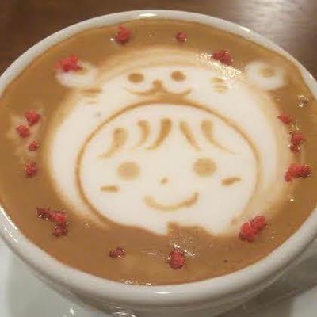
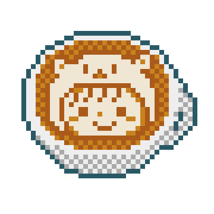
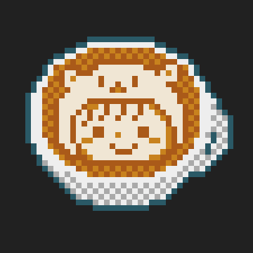
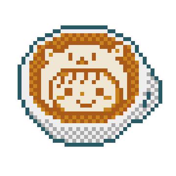
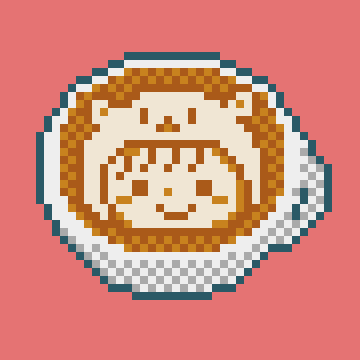
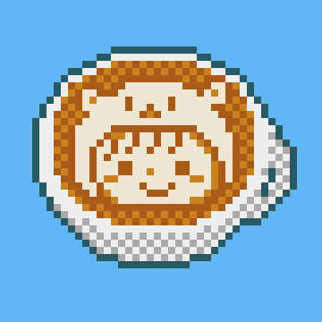
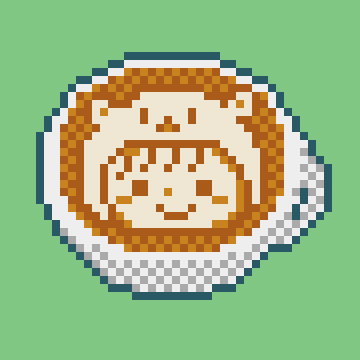
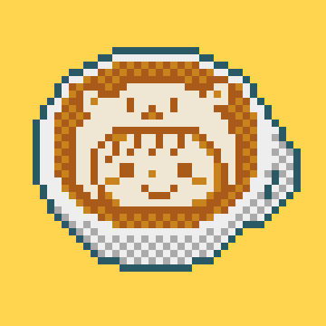

# Icons
## Original

|photo|normal|maccha|
|:-:|:-:|:-:|
||||

## Color Variation

|white|black|clear|
|:-:|:-:|:-:|
||||

|red|blue|green|yellow|
|:-:|:-:|:-:|:-:|
|||||

pixel art: https://neutralx0.net/tools/dot3/
color scheme: https://www.materialui.co/colors

🥃
